# Specifications

## Overview

Crumbs is a storage system for work items that supports exploratory development through trails. We use a breadcrumb metaphor where individual work items (crumbs) can be grouped into trails for experimental work, then either completed (making crumbs permanent) or abandoned (cleaning up associated crumbs atomically). The system provides a Cupboard interface for backend-agnostic storage access and a Table interface for uniform CRUD operations.

This document indexes all PRDs, use cases, and test suites in the project and shows how they relate. For goals and boundaries, see [VISION.md](VISION.md). For components and interfaces, see [ARCHITECTURE.md](ARCHITECTURE.md).

## Roadmap Summary

Table 1 Roadmap Summary

| Release | Name | Use Cases (done / total) | Status |
|---------|------|--------------------------|--------|
| 01.0 | Core Storage with SQLite Backend | 3 / 4 | in progress |
| 01.1 | Post-Core Validation | 0 / 2 | not started |
| 02.0 | Properties with Enforcement | 0 / 2 | not started |
| 02.1 | Issue-Tracking CLI and Benchmarks | 0 / 3 | not started |
| 03.0 | Trails and Stashes | 0 / 1 | not started |
| 99.0 | Unscheduled | 0 / 2 | not started |

## PRD Index

Table 2 PRD Index

| PRD | Title | Summary |
|-----|-------|---------|
| [prd-configuration-directories](product-requirements/prd-configuration-directories.yaml) | Configuration and Data Directories | Defines platform-specific configuration and data directory locations for the CLI |
| [prd-crumbs-interface](product-requirements/prd-crumbs-interface.yaml) | Crumbs Interface | Defines the Crumb entity structure, state transitions, and property operations |
| [prd-cupboard-cli](product-requirements/prd-cupboard-cli.yaml) | Cupboard CLI | Specifies the command-line interface for cupboard operations |
| [prd-cupboard-core](product-requirements/prd-cupboard-core.yaml) | Cupboard Core Interface | Defines the Cupboard and Table interfaces for backend-agnostic storage access |
| [prd-metadata-interface](product-requirements/prd-metadata-interface.yaml) | Metadata Interface | Defines the Metadata entity for schema registration and versioning |
| [prd-properties-interface](product-requirements/prd-properties-interface.yaml) | Properties Interface | Defines Property and Category entities for typed, enumerated crumb attributes |
| [prd-sqlite-backend](product-requirements/prd-sqlite-backend.yaml) | SQLite Backend | Specifies JSONL persistence format, SQLite schema, and startup/write/shutdown sequences |
| [prd-stash-interface](product-requirements/prd-stash-interface.yaml) | Stash Interface | Defines the Stash entity for shared state with content versioning |
| [prd-trails-interface](product-requirements/prd-trails-interface.yaml) | Trails Interface | Defines the Trail entity for grouping crumbs with Complete/Abandon lifecycle |

## Use Case Index

Table 3 Use Case Index

| Use Case | Title | Release | Status | Test Suite |
|----------|-------|---------|--------|------------|
| [rel01.0-uc001-cupboard-lifecycle](use-cases/rel01.0-uc001-cupboard-lifecycle.yaml) | Configuration and Cupboard Lifecycle | 01.0 | done | [test004-cupboard-lifecycle](test-suites/test004-cupboard-lifecycle.yaml) |
| [rel01.0-uc002-sqlite-crud](use-cases/rel01.0-uc002-sqlite-crud.yaml) | SQLite Backend CRUD Operations | 01.0 | done | [test006-sqlite-crud](test-suites/test006-sqlite-crud.yaml) |
| [rel01.0-uc003-crud-operations](use-cases/rel01.0-uc003-crud-operations.yaml) | Core CRUD Operations | 01.0 | done | [test004-cupboard-lifecycle](test-suites/test004-cupboard-lifecycle.yaml) |
| [rel01.0-uc004-scaffolding-validation](use-cases/rel01.0-uc004-scaffolding-validation.yaml) | Scaffolding Validation | 01.0 | pending | [test005-scaffolding-validation](test-suites/test005-scaffolding-validation.yaml) |
| [rel01.1-uc001-go-install](use-cases/rel01.1-uc001-go-install.yaml) | Go Install Validation | 01.1 | pending | [test007-go-install](test-suites/test007-go-install.yaml) |
| [rel01.1-uc002-jsonl-git-roundtrip](use-cases/rel01.1-uc002-jsonl-git-roundtrip.yaml) | JSONL Git Roundtrip | 01.1 | pending | [test002-jsonl-git-roundtrip](test-suites/test002-jsonl-git-roundtrip.yaml) |
| [rel02.0-uc001-property-enforcement](use-cases/rel02.0-uc001-property-enforcement.yaml) | Property Enforcement | 02.0 | pending | [test008-property-enforcement](test-suites/test008-property-enforcement.yaml) |
| [rel02.0-uc002-regeneration-compatibility](use-cases/rel02.0-uc002-regeneration-compatibility.yaml) | Regeneration Compatibility | 02.0 | pending | [test009-regeneration-compatibility](test-suites/test009-regeneration-compatibility.yaml) |
| [rel02.1-uc001-issue-tracking-cli](use-cases/rel02.1-uc001-issue-tracking-cli.yaml) | Issue-Tracking CLI | 02.1 | pending | [test010-issue-tracking-cli](test-suites/test010-issue-tracking-cli.yaml) |
| [rel02.1-uc002-table-benchmarks](use-cases/rel02.1-uc002-table-benchmarks.yaml) | Table Benchmarks | 02.1 | pending | [test003-table-benchmarks](test-suites/test003-table-benchmarks.yaml) |
| [rel02.1-uc003-self-hosting](use-cases/rel02.1-uc003-self-hosting.yaml) | Self-Hosting | 02.1 | pending | [test001-self-hosting](test-suites/test001-self-hosting.yaml) |
| [rel03.0-uc001-trail-exploration](use-cases/rel03.0-uc001-trail-exploration.md) | Trail-Based Exploration | 03.0 | pending | - |
| [rel99.0-uc001-blazes-templates](use-cases/rel99.0-uc001-blazes-templates.md) | Agent Uses Blazes (Workflow Templates) | 99.0 | pending | - |
| [rel99.0-uc002-docker-bootstrap](use-cases/rel99.0-uc002-docker-bootstrap.md) | Docker Bootstrap (Docs to Working System) | 99.0 | pending | - |

## Test Suite Index

Table 4 Test Suite Index

| Test Suite | Title | Traces | Test Cases |
|------------|-------|--------|------------|
| [test001-self-hosting](test-suites/test001-self-hosting.yaml) | Self-hosting operations | rel02.1-uc003-self-hosting | 15 |
| [test002-jsonl-git-roundtrip](test-suites/test002-jsonl-git-roundtrip.yaml) | JSONL git roundtrip | rel01.1-uc002-jsonl-git-roundtrip | 8 |
| [test003-table-benchmarks](test-suites/test003-table-benchmarks.yaml) | Table benchmark operations | rel02.1-uc002-table-benchmarks | 6 |
| [test004-cupboard-lifecycle](test-suites/test004-cupboard-lifecycle.yaml) | Cupboard lifecycle and CRUD | rel01.0-uc001-cupboard-lifecycle, rel01.0-uc003-crud-operations | 12 |
| [test005-scaffolding-validation](test-suites/test005-scaffolding-validation.yaml) | Scaffolding validation | rel01.0-uc004-scaffolding-validation | 8 |
| [test006-sqlite-crud](test-suites/test006-sqlite-crud.yaml) | SQLite CRUD operations | rel01.0-uc002-sqlite-crud | 10 |
| [test007-go-install](test-suites/test007-go-install.yaml) | Go install validation | rel01.1-uc001-go-install | 5 |
| [test008-property-enforcement](test-suites/test008-property-enforcement.yaml) | Property enforcement operations | rel02.0-uc001-property-enforcement | 28 |
| [test009-regeneration-compatibility](test-suites/test009-regeneration-compatibility.yaml) | Regeneration compatibility | rel02.0-uc002-regeneration-compatibility | 7 |
| [test010-issue-tracking-cli](test-suites/test010-issue-tracking-cli.yaml) | Issue-tracking CLI operations | rel02.1-uc001-issue-tracking-cli | 18 |

## Traceability Diagram

|  |
|:--:|

```plantuml
@startuml
!theme plain
skinparam backgroundColor white
skinparam componentStyle rectangle
skinparam linetype ortho

package "PRDs" {
  [prd-cupboard-core] as prd_core
  [prd-sqlite-backend] as prd_sqlite
  [prd-crumbs-interface] as prd_crumbs
  [prd-trails-interface] as prd_trails
  [prd-properties-interface] as prd_props
  [prd-stash-interface] as prd_stash
  [prd-configuration-directories] as prd_config
  [prd-cupboard-cli] as prd_cli
  [prd-metadata-interface] as prd_meta
}

package "Use Cases - Release 01.0" {
  [rel01.0-uc001\ncupboard-lifecycle] as uc001
  [rel01.0-uc002\nsqlite-crud] as uc002
  [rel01.0-uc003\ncrud-operations] as uc003
  [rel01.0-uc004\nscaffolding-validation] as uc004
}

package "Use Cases - Release 01.1" {
  [rel01.1-uc001\ngo-install] as uc101
  [rel01.1-uc002\njsonl-git-roundtrip] as uc102
}

package "Use Cases - Release 02.0" {
  [rel02.0-uc001\nproperty-enforcement] as uc201
  [rel02.0-uc002\nregeneration-compatibility] as uc202
}

package "Use Cases - Release 02.1" {
  [rel02.1-uc001\nissue-tracking-cli] as uc211
  [rel02.1-uc002\ntable-benchmarks] as uc212
  [rel02.1-uc003\nself-hosting] as uc213
}

package "Use Cases - Release 03.0" {
  [rel03.0-uc001\ntrail-exploration] as uc301
}

package "Use Cases - Unscheduled" {
  [rel99.0-uc001\nblazes-templates] as uc901
  [rel99.0-uc002\ndocker-bootstrap] as uc902
}

package "Test Suites" {
  [test004\ncupboard-lifecycle] as ts4
  [test006\nsqlite-crud] as ts6
  [test005\nscaffolding-validation] as ts5
  [test007\ngo-install] as ts7
  [test002\njsonl-git-roundtrip] as ts2
  [test008\nproperty-enforcement] as ts8
  [test009\nregeneration-compatibility] as ts9
  [test010\nissue-tracking-cli] as ts10
  [test003\ntable-benchmarks] as ts3
  [test001\nself-hosting] as ts1
}

' Use case to PRD relationships
uc001 --> prd_core
uc001 --> prd_sqlite
uc002 --> prd_core
uc002 --> prd_sqlite
uc003 --> prd_core
uc003 --> prd_crumbs
uc004 --> prd_core
uc004 --> prd_sqlite
uc004 --> prd_crumbs

uc101 --> prd_config
uc102 --> prd_sqlite
uc102 --> prd_config

uc201 --> prd_props
uc201 --> prd_crumbs
uc201 --> prd_sqlite
uc202 --> prd_sqlite

uc211 --> prd_cli
uc211 --> prd_crumbs
uc212 --> prd_core
uc213 --> prd_cli
uc213 --> prd_crumbs
uc213 --> prd_sqlite

uc301 --> prd_trails
uc301 --> prd_core

uc901 --> prd_crumbs
uc901 --> prd_trails
uc901 --> prd_stash
uc902 --> prd_core
uc902 --> prd_crumbs
uc902 --> prd_sqlite
uc902 --> prd_config

' Test suite to use case relationships
ts4 --> uc001
ts4 --> uc003
ts6 --> uc002
ts5 --> uc004
ts7 --> uc101
ts2 --> uc102
ts8 --> uc201
ts9 --> uc202
ts10 --> uc211
ts3 --> uc212
ts1 --> uc213

@enduml
```

|Figure 1 Traceability between PRDs, use cases, and test suites |

## Coverage Gaps

The following gaps exist in the current specification coverage.

### Use Cases Without Test Suites

| Use Case | Title | Release |
|----------|-------|---------|
| rel03.0-uc001-trail-exploration | Trail-Based Exploration | 03.0 |
| rel99.0-uc001-blazes-templates | Agent Uses Blazes (Workflow Templates) | 99.0 |
| rel99.0-uc002-docker-bootstrap | Docker Bootstrap (Docs to Working System) | 99.0 |

### PRDs Not Referenced by Use Cases

| PRD | Title | Notes |
|-----|-------|-------|
| prd-metadata-interface | Metadata Interface | No use case exercises metadata operations |

These gaps should be addressed before the respective releases are marked complete.
